```mermaid
graph TD;
    id1(Click on dropdown menu)-->id2(Select 'EUR' option)
    id2-->id3(Check if the currency changed to '€' for the products)

    style id3 fill:#5AE48D,color:#000000
```

# Homepage

---

## Change the pagination Size

### Precondition

Visit `https://academybugs.com/store/`

### Descripton

Check if user can change the pagination size on the homepage.

### Steps

### Result

Page should only load 10 products

---

## Change the sorting of the products

### Precondition

Visit `https://academybugs.com/store/`

### Descripton

Check if user can sort the products on the homepage

### Steps

### Result

Page should sort the products accordingly from low to high price

---

## Change the currency of the products

### Precondition

Visit `https://academybugs.com/store/`

### Descripton

Check if user can change the currency option and the price changes accordingly

### Steps

### Result

Value of the products should be changed accordingly to the new currency

---

## Search for a product

### Precondition

Visit `https://academybugs.com/store/`

### Descripton

Check if the user can search for a product successfully

### Steps

### Result

Only one item is displayed on the homepage (Bright Gold Purse With Chain)

---

## Filter by price

### Precondition

Visit `https://academybugs.com/store/`

### Descripton

Check if the user can filter the products by price

### Steps

### Result

Only the products withing that price range should be visible on the homepage

---