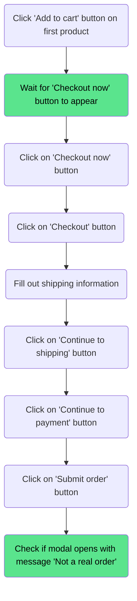
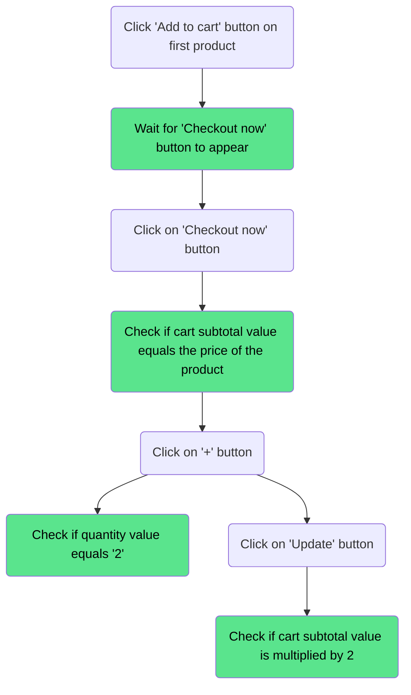
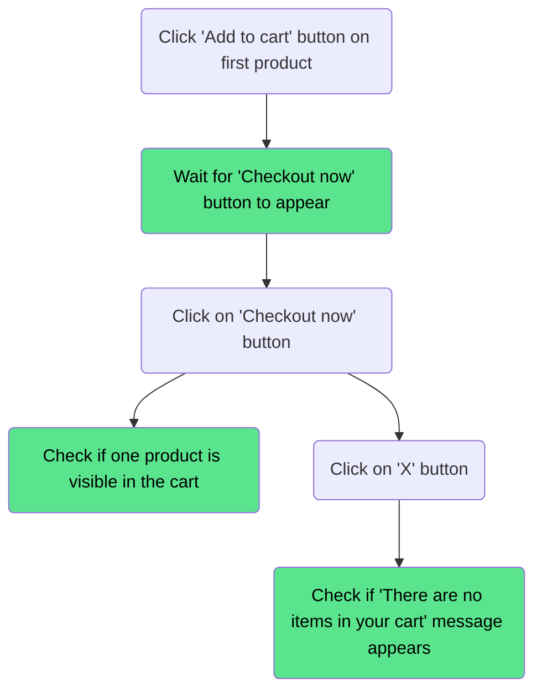

# My Cart

---

## Purchase an item

### Precondition

Visit `https://academybugs.com/store/`

### Descripton

Check if user is able to purchase an item

### Steps

### Result

User should be able to purchase a product

---

## Update the quantity of an added product

### Precondition

Visit `https://academybugs.com/store/`

### Descripton

Check if user is able to update the quantity of an item after added to cart and cart subtotal is adjusted accordingly

### Steps

### Result

On `my-cart` page product should be displayed with the quantity value equaling to 2

---

## Remove a product from cart

### Precondition

Visit `https://academybugs.com/store/`

### Descripton

Check if the user is able to remove a product from the cart

### Steps

### Result

The product should be removed from the cart and user receives a 'There are no items in your cart' message

---