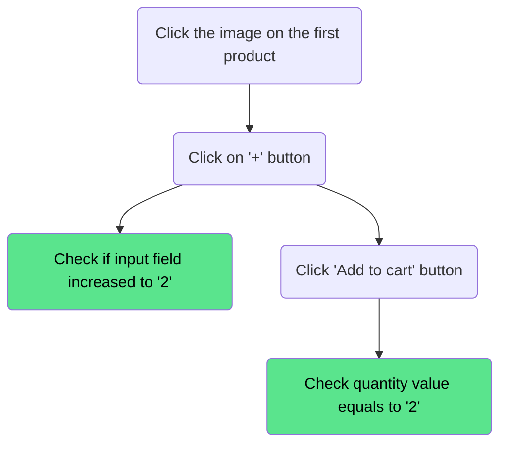
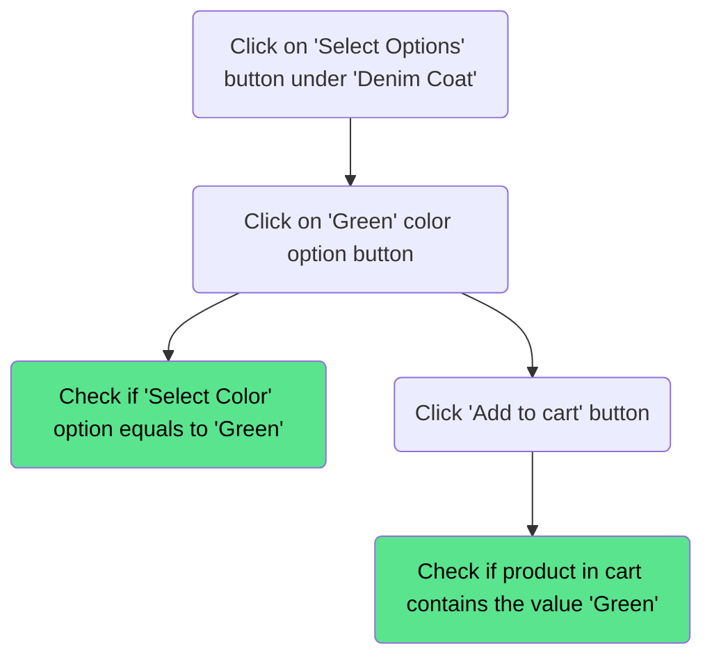
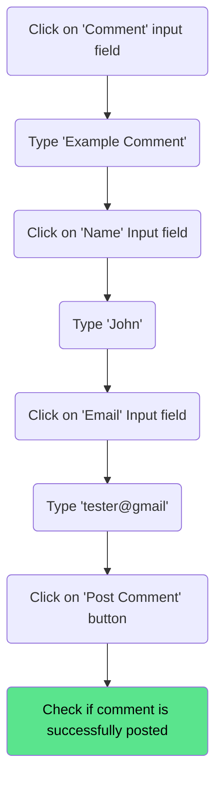

# Product

---

## Add multiple items to cart

### Precondition

Visit `https://academybugs.com/store/`

### Descripton

Check if user is able to add multiple quantities of an item to cart

### Steps

### Result

Product should be displayed with the quantity value equaling to 2

---

## Add a product with colour options to cart

### Precondition

Visit `https://academybugs.com/store/`

### Descripton

Check if the user is able to add a product in cart with a specified color option

### Steps

### Result

Product should be added to cart with the correct color option

---

## Post a comment on a product

### Precondition

Visit `https://academybugs.com/store/denim-coat/`

### Descripton

Check if the user is able to post a comment on a product

### Steps

### Result

Comment should be posted and displayed on the product page

---